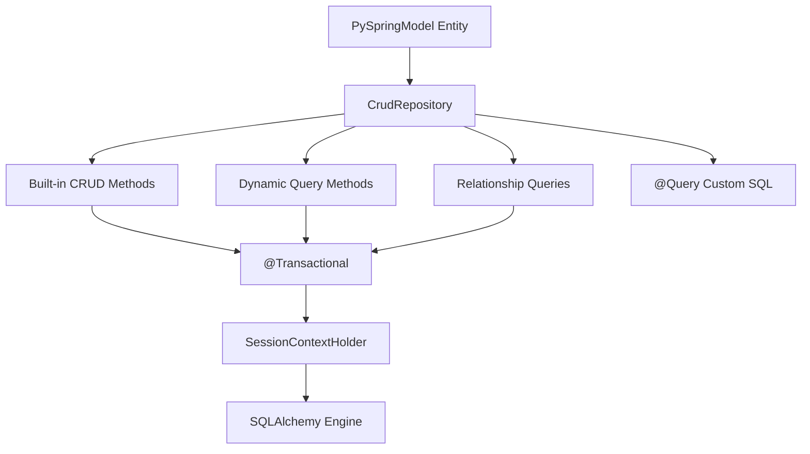

# PySpring Model

**PySpring Model** is the ORM and data-access module for the PySpring framework. It provides a streamlined interface for SQL database operations, built on top of [SQLModel](https://sqlmodel.tiangolo.com/) and [SQLAlchemy](https://www.sqlalchemy.org/).

---

**Source Code**: <a href="https://github.com/PythonSpring/pyspring-model" target="_blank">https://github.com/PythonSpring/pyspring-model</a>

**Install**: `pip install git+https://github.com/PythonSpring/pyspring-model.git`

---

## What it does

PySpring Model brings Spring Data JPA-style repository patterns to Python:

* **SQLModel integration** — Define models as Python classes with type hints. Get automatic table creation and Pydantic validation.
* **CRUD Repository** — Inherit from `CrudRepository` to get `save`, `find_by_id`, `delete`, `upsert`, and more — with zero boilerplate.
* **Dynamic query generation** — Declare method signatures like `find_by_name_and_status` and PySpring implements them automatically from the method name. Supports `find_by_`, `get_by_`, `find_all_by_`, `get_all_by_`, `count_by_`, `exists_by_`, `delete_by_`, and `delete_all_by_` prefixes.
* **Field operations** — Use suffixes like `_gt`, `_in`, `_like`, `_between`, `_is_null`, `_starts_with`, `_contains`, and more for comparison, membership, range, null-check, and pattern-matching queries.
* **Relationship queries** — Query across SQLModel relationships with automatic join generation — e.g., `find_all_by_members_status` generates a join to the related table.
* **Custom SQL queries** — Use the `@Query` decorator for raw SQL when dynamic methods aren't enough.
* **Transaction management** — Declarative `@Transactional` decorator with 7 propagation types, matching Spring's transaction model.
* **Context-based sessions** — Thread-safe session handling via `SessionContextHolder` using Python `contextvars`, with automatic cleanup per HTTP request.
* **RESTful API generation** — Automatically exposes basic CRUD endpoints for your models.

## Architecture

## Requirements

- Python >= 3.11, < 3.13
- py-spring-core >= 0.3.5
- sqlmodel >= 0.0.38

## Next steps

- **[Getting Started](getting-started.md)** — Install, configure, and run your first query.
- **[CRUD Repository](crud-repository.md)** — Built-in operations for every entity.
- **[Dynamic Queries](dynamic-queries.md)** — Auto-implemented methods from naming conventions.
- **[Field Operations](field-operations.md)** — Comparison, membership, range, null-check, and pattern-matching operators.
- **[Relationship Queries](relationship-queries.md)** — Query across relationships with automatic join generation.
- **[Custom Queries](custom-queries.md)** — Raw SQL with the `@Query` decorator.
- **[Transaction Management](transactions.md)** — `@Transactional` and propagation types.
- **[Session Management](sessions.md)** — How sessions are managed per request and per context.
