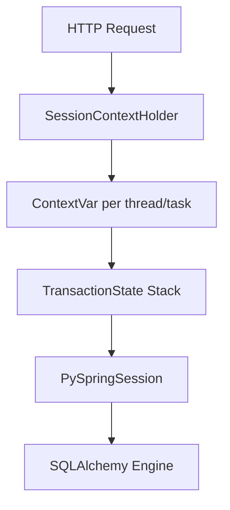

# Session Management

PySpring Model handles database sessions automatically through `SessionContextHolder`, which provides thread-safe and async-safe session isolation using Python's `contextvars`.

## How it works

`SessionContextHolder` maintains a stack of `TransactionState` objects per execution context (thread or async task). Each `TransactionState` holds a reference to a `PySpringSession` and a depth counter for nested transactions.



## Automatic session management

In most cases, you don't interact with `SessionContextHolder` directly. The `@Transactional` decorator and `CrudRepository` methods manage sessions for you:

1. `@Transactional` creates or joins a transaction via `TransactionManager`
2. `TransactionManager` delegates to the appropriate `PropagationHandler`
3. The handler uses `SessionContextHolder` to push/pop transaction states
4. `CrudRepository` methods call `SessionContextHolder.get_or_create_session()` to get the current session

## HTTP request lifecycle

For HTTP applications, PySpring Model automatically registers a session cleanup middleware. This ensures sessions are properly closed after each request:

1. Request arrives
2. Controller/service methods use `@Transactional` — sessions are created as needed
3. After the response is sent, the middleware calls `SessionContextHolder.clear()`
4. All sessions in the current context are closed

## Manual session usage

For cases where you need direct session control (e.g., in `@SkipAutoImplementation` methods), use `PySpringModel.create_managed_session()`:

```python
from py_spring_model import PySpringModel

with PySpringModel.create_managed_session() as session:
    result = session.exec(select(User).where(User.email == email))
    user = result.first()
    # Session commits automatically on exit
    # Rolls back on exception
```

The managed session context manager:

- Creates a new `PySpringSession`
- Commits on successful exit (configurable with `should_commit=False`)
- Rolls back on exception
- Always closes the session in `finally`

### Read-only sessions

```python
with PySpringModel.create_managed_session(should_commit=False) as session:
    users = session.exec(select(User)).all()
    # No commit — read-only
```

## SessionContextHolder API

| Method | Description |
|--------|-------------|
| `get_or_create_session()` | Get the current session or create a new one |
| `has_active_transaction()` | Check if a transaction is active (depth >= 1) |
| `has_session()` | Check if a session exists in the current context |
| `current_state()` | Get the current `TransactionState` (or `None`) |
| `push_state(state)` | Push a new transaction state onto the stack |
| `pop_state()` | Pop the top transaction state from the stack |
| `clear()` | Close all sessions and clear the state stack |

## Context isolation

`SessionContextHolder` uses `ContextVar`, which means:

- Each thread gets its own session stack
- Each `asyncio` task gets its own session stack
- No cross-contamination between concurrent requests
- No need for explicit thread-local management

This is the same isolation mechanism used by Python's `decimal.localcontext()` and `contextvars.copy_context()`.
