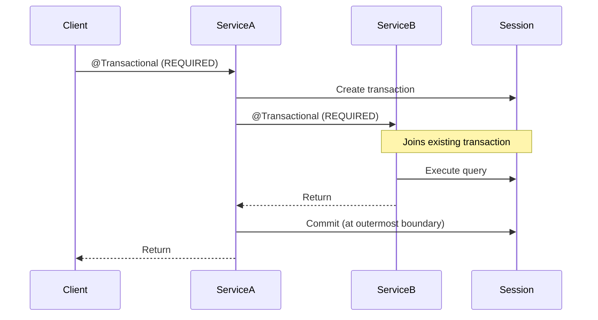

# Transaction Management

PySpring Model provides declarative transaction management through the `@Transactional` decorator, modeled after Spring's `@Transactional` annotation.

## Basic usage

All `CrudRepository` built-in methods are already transactional. You can also use `@Transactional` on your own methods:

```python
from py_spring_model import Transactional

class UserService:
    user_repository: UserRepository

    @Transactional
    def create_user(self, name: str, email: str) -> User:
        user = User(name=name, email=email)
        return self.user_repository.save(user)
```

When used without parameters, `@Transactional` defaults to `Propagation.REQUIRED`.

## Propagation types

Control how transactions interact with each other by specifying a propagation type:

```python
from py_spring_model import Transactional, Propagation

@Transactional(propagation=Propagation.REQUIRES_NEW)
def write_audit_log(self, message: str) -> None:
    # Always runs in a new, independent transaction
    ...
```

### REQUIRED (default)

Join the existing transaction if one exists. Create a new transaction if none exists.

```python
@Transactional  # or @Transactional(propagation=Propagation.REQUIRED)
def create_user(self, name: str) -> User:
    ...
```

This is the most common propagation type. Multiple `@Transactional(propagation=Propagation.REQUIRED)` calls in the same call chain share one transaction.

### REQUIRES_NEW

Always create a new, independent transaction. If an existing transaction is active, it is suspended until the new transaction completes.

```python
@Transactional(propagation=Propagation.REQUIRES_NEW)
def write_audit_log(self, message: str) -> None:
    ...
```

Use this for operations that must commit independently, such as audit logging that should persist even if the outer transaction rolls back.

### SUPPORTS

Run within the existing transaction if one is active. If no transaction exists, run without one.

```python
@Transactional(propagation=Propagation.SUPPORTS)
def read_user(self, id: int) -> Optional[User]:
    ...
```

Useful for read-only operations that can work with or without a transaction.

### MANDATORY

Must run within an existing transaction. Raises `TransactionRequiredError` if no transaction is active.

```python
@Transactional(propagation=Propagation.MANDATORY)
def update_balance(self, user_id: int, amount: float) -> None:
    ...
```

Use this to enforce that a method is always called within a transactional context.

### NOT_SUPPORTED

Suspend the existing transaction (if any) and run without one.

```python
@Transactional(propagation=Propagation.NOT_SUPPORTED)
def send_notification(self, user_id: int) -> None:
    ...
```

### NEVER

Must not run within a transaction. Raises `ExistingTransactionError` if a transaction is active.

```python
@Transactional(propagation=Propagation.NEVER)
def health_check(self) -> bool:
    ...
```

### NESTED

Run within a savepoint if a transaction exists. If no transaction exists, create a new one (behaves like `REQUIRED`).

```python
@Transactional(propagation=Propagation.NESTED)
def try_operation(self) -> None:
    ...
```

If the nested operation fails, only the savepoint is rolled back — the outer transaction can continue.

## Propagation summary

| Propagation | Existing Tx | No Existing Tx |
|-------------|-------------|----------------|
| `REQUIRED` | Join | Create new |
| `REQUIRES_NEW` | Suspend, create new | Create new |
| `SUPPORTS` | Join | Run without |
| `MANDATORY` | Join | Raise error |
| `NOT_SUPPORTED` | Suspend, run without | Run without |
| `NEVER` | Raise error | Run without |
| `NESTED` | Create savepoint | Create new |

## Transaction flow



## Error handling

If an exception occurs within a `@Transactional` method:

- The transaction (or savepoint for `NESTED`) is rolled back
- The exception propagates to the caller
- For `REQUIRED`, rollback only happens at the outermost transactional boundary

```python
@Transactional
def transfer_funds(self, from_id: int, to_id: int, amount: float) -> None:
    self.debit(from_id, amount)
    self.credit(to_id, amount)  # If this fails, debit is also rolled back
```

## Exceptions

| Exception | Raised by | When |
|-----------|-----------|------|
| `TransactionRequiredError` | `MANDATORY` | No active transaction exists |
| `ExistingTransactionError` | `NEVER` | An active transaction exists |
