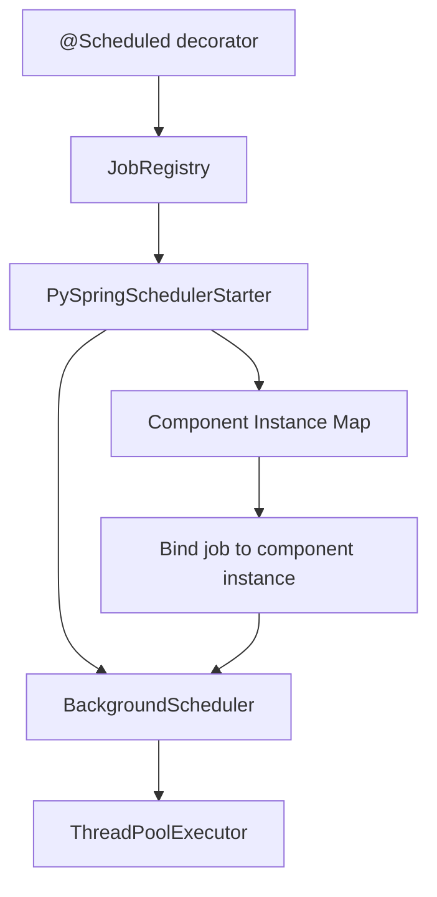

# PySpring Scheduler

**PySpring Scheduler** is the task scheduling module for the PySpring framework. It provides background job execution with full dependency injection support, built on top of [APScheduler](https://apscheduler.readthedocs.io/).

---

**Source Code**: <a href="https://github.com/PythonSpring/pyspring-scheduler" target="_blank">https://github.com/PythonSpring/pyspring-scheduler</a>

**Install**: `pip install git+https://github.com/PythonSpring/pyspring-scheduler.git`

---

## What it does

* **Component-integrated scheduling** — Use `@Scheduled` on component methods with full access to injected dependencies.
* **Multiple trigger types** — Interval, cron, date, calendar interval, and combined triggers via APScheduler.
* **Configurable thread pool** — Control the number of worker threads, max instances, timezone, and coalesce behavior.
* **Job coalescing** — Handle missed executions when the scheduler was down.
* **Max instance limits** — Prevent overlapping executions of the same job.
* **Regular function support** — Schedule standalone functions, not just component methods.

## Architecture

## Requirements

- Python >= 3.11, < 3.13
- py-spring-core >= 0.0.10
- apscheduler >= 3.11.0

## Next steps

- **[Getting Started](getting-started.md)** — Install, configure, and schedule your first job.
- **[Triggers](triggers.md)** — Interval, cron, date, and combined triggers.
- **[Configuration](configuration.md)** — Thread pool, timezone, coalesce, and max instances.

!!! tip
    For a tutorial-style introduction, see the [Scheduling tutorial](../../tutorial/scheduling.md) in the core framework docs.
